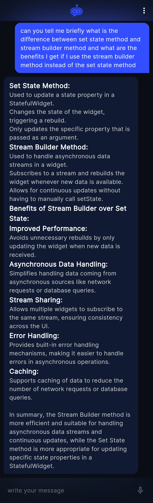
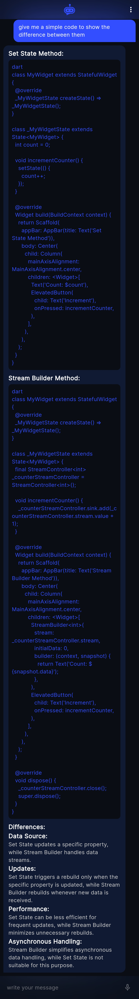

# Chapt 💬

- [Chapt 💬](#chapt-)
  - [Introduction 🚀](#introduction-)
  - [Features 🌟](#features-)
  - [Preview 📱](#preview-)
      - [1. Onboarding Page: 🚀](#1-onboarding-page-)
      - [2. Registration \& Login: 🔐](#2-registration--login-)
      - [3. Home Page: 🏠](#3-home-page-)
      - [4. Message Bubbles: 💬](#4-message-bubbles-)
  - [Installation 🛠️](#installation-️)
  - [Contributing 🤝](#contributing-)
  - [Contact 📞](#contact-)

## Introduction 🚀

Welcome to Chapt – your friendly gateway to chatting with Gemini AI! 🌟 Whether you're seeking advice, sparking ideas, or simply craving a chat, Chapt is here to make your conversations effortless and enjoyable. Let's dive in and start chatting! 💬✨

## Features 🌟

- 🎤 Speak-to-Text Messaging: Type less, chat more! Just speak your mind, and Chapt will do the typing for you!

- 📢 Customizable Text-to-Speech: Hear the magic! Let Chapt read out messages for you, and hey, tweak the speed to match your vibe.

- 🎨 Message Formatting for Enhanced UI: Style meets substance! Chapt intelligently formats responses to keep your chats looking fresh and feeling lively.

- 🏗️ Built with MVVM and Stream Builders: It's not just pretty; it's smart too! Chapt's built using MVVM and stream builders for clean, high-performance code.

## Preview 📱

Check out some snapshots of Chapt in action 📸:

#### 1. Onboarding Page: 🚀

  <p float="left">
    
    
  </p>

#### 2. Registration & Login: 🔐

  <p float="left">
    
    
  </p>

#### 3. Home Page: 🏠

  <p float="left">
    
  </p>

#### 4. Message Bubbles: 💬

  <div style="display: flex; align-items: flex-start;">
    
    
  </div>

## Installation 🛠️

Ready to dive in? Here's how to get started:

1. Clone the repository:

    ```bash
    git clone https://github.com/Amr-Mahm0ud/Chapt.git
    ```

2. Navigate to the project directory:

    ```bash
    cd Chapt
    ```

3. Install the necessary dependencies:

    ```bash
    flutter pub get
    ```

## Contributing 🤝

Feeling inspired? We'd love to have you on board! Here's how you can contribute:

1. Fork the repository
2. Create a new branch (`git checkout -b feature-branch`)
3. Commit your changes (`git commit -m 'Add some feature'`)
4. Push to the branch (`git push origin feature-branch`)
5. Open a pull request

## Contact 📞

If you have any questions or suggestions, feel free to contact me at:

- Linkedin: [3mr-m7mud](https://www.linkedin.com/in/3mr-m7mud/)
- Email: <amrm7mud.dev@gmail.com>
